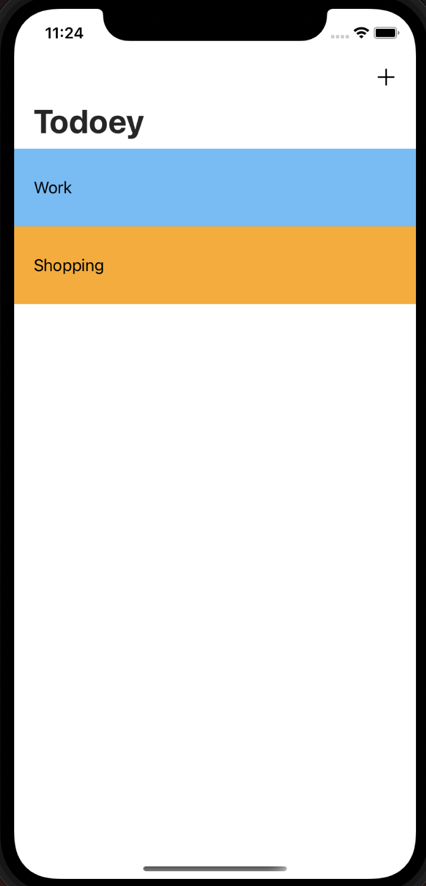
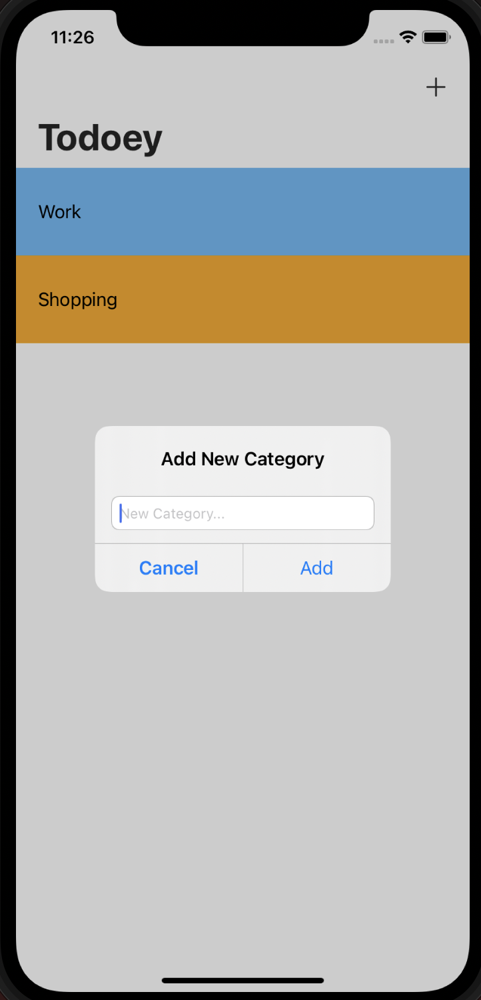
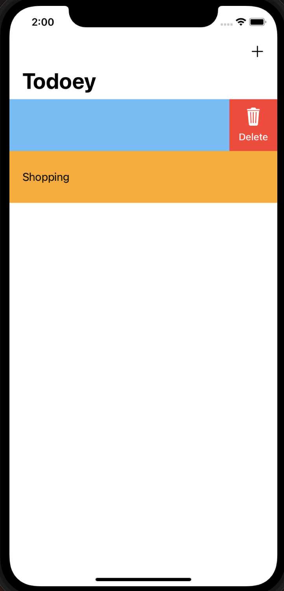
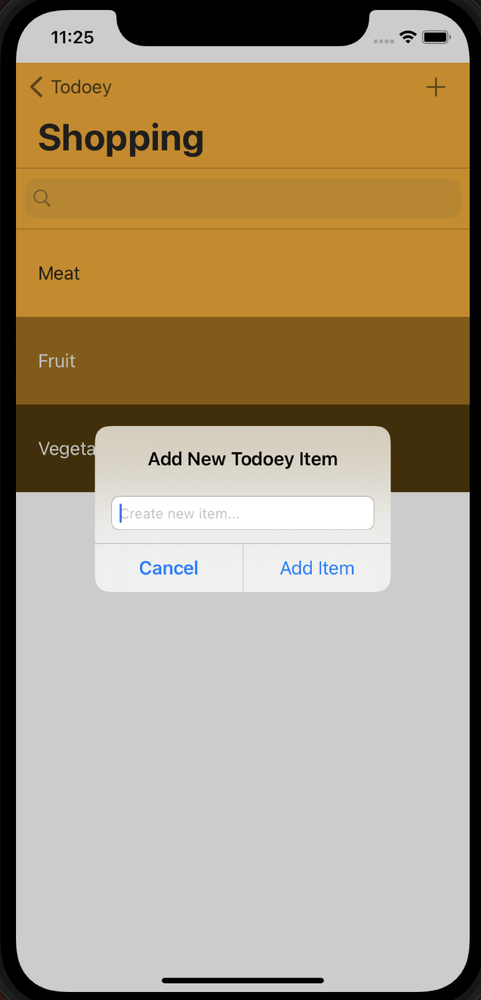
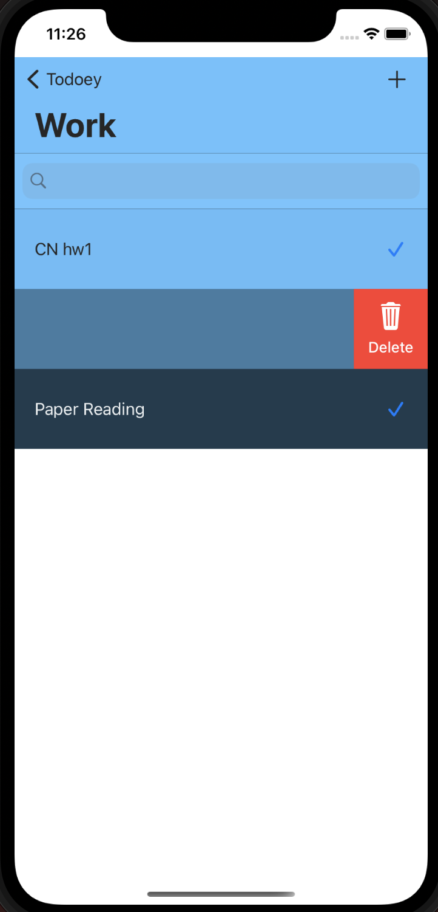
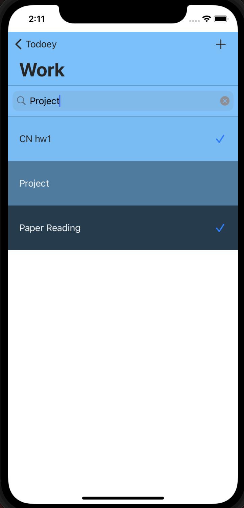
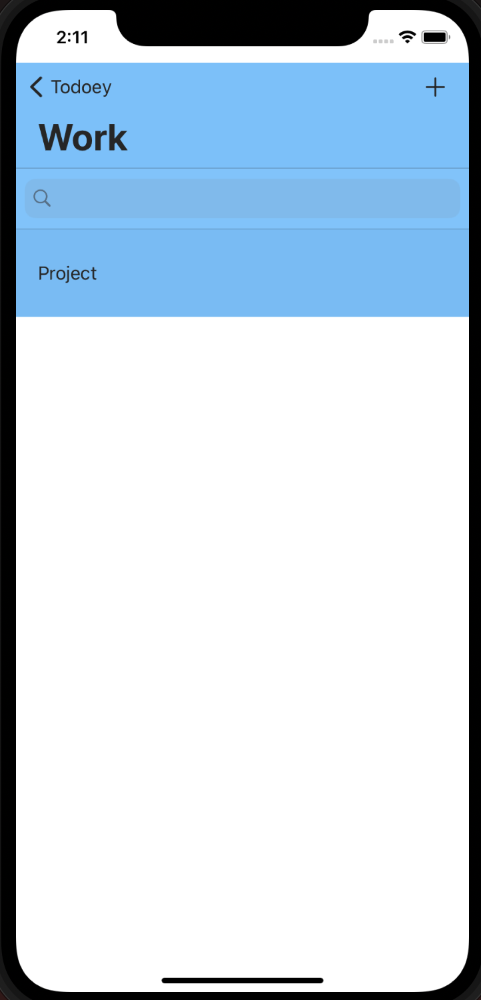

# Todoey
A todolist iOS app

## Demo
### Category List
| Overview of Category | Add New Category | Delete Category |
| --- | --- | --- |
|   |  | |
### Item List
| Add New Item | Delete & Checked Item | Search For Items (Before) | Search For Items (After) |
| --- | --- | --- | --- |
|   |  |  |  |

## How to run the app
1. git clone or download the project
2. run `pod install` (make sure that Cocoapods is installed)
3. open Todoey.xcworkspace and run the app on the simulator
